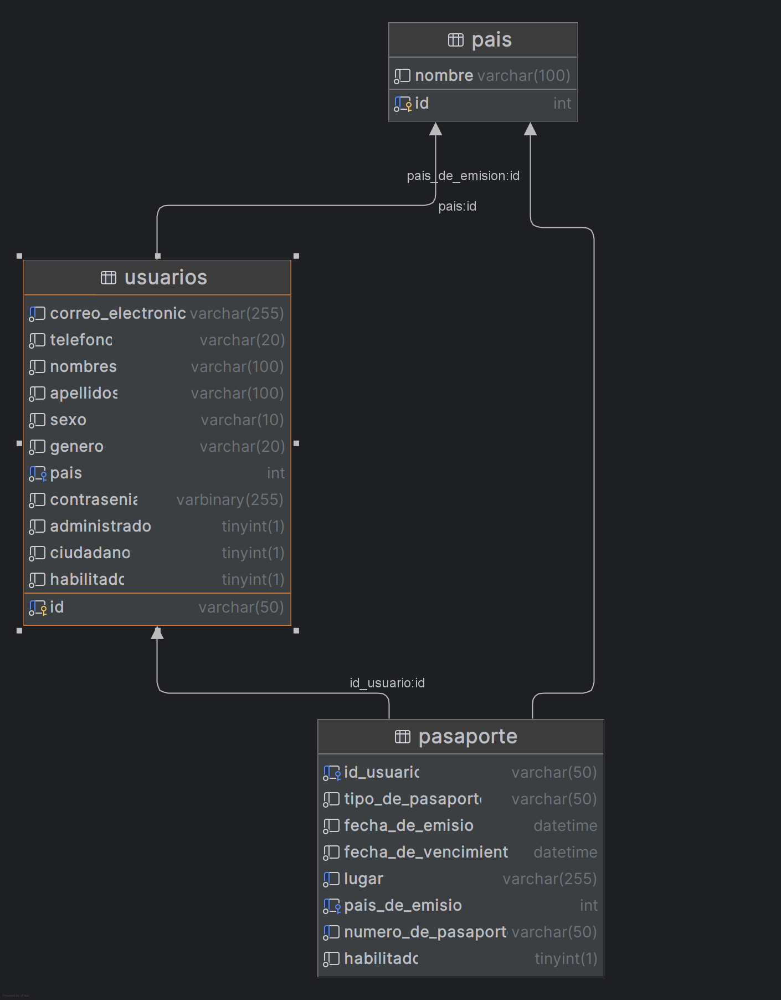

# RegistroDeUsuario

# Diagrama Fisico




## Metadatos de la Base de Datos ProyectoDB

### Tablas y Estructura
| Tabla | Descripción | Clave Primaria | Claves Foráneas | Campos Principales |
|-------|-------------|----------------|-----------------|-------------------|
| **pais** | Catálogo de países | id (INT AUTO_INCREMENT) | - | nombre |
| **usuarios** | Registro de usuarios | id (VARCHAR(50)) | pais → pais(id) | correo_electronico, telefono, nombres, apellidos, sexo, genero, contrasenia |
| **pasaporte** | Documentos de usuarios | Compuesta (id_usuario + numero_de_pasaporte + lugar) | id_usuario → usuarios(id), pais_de_emision → pais(id) | tipo_de_pasaporte, fecha_emision, fecha_vencimiento, numero_de_pasaporte |

### Índices y Restricciones

- **usuarios**: UNIQUE(correo_electronico), INDEX(idx_correo), INDEX(idx_pais)
- **pasaporte**: UNIQUE(uk_pasaporte_lugar), INDEX(idx_usuario), INDEX(idx_pasaporte_numero)

### Relaciones Entidad-Relación

```
pais (1) ----< usuarios (N)
                |
pais (1) ----< pasaporte (N)
usuarios (1) ----> pasaporte (N)
```

| Campo  | Tabla | Tipo               | NOT NULL | UNIQUE |
| ------ | ----- | ------------------ | -------- | ------ |
| id     | pais  | INT AUTO_INCREMENT | ✓        | PK     |
| nombre | pais  | VARCHAR(100)       | ✓        | -      |

| Campo              | Tabla    | Tipo                  | NOT NULL | UNIQUE |
| ------------------ | -------- | --------------------- | -------- | ------ |
| id                 | usuarios | VARCHAR(50)           | ✓        | PK     |
| correo_electronico | usuarios | VARCHAR(255)          | ✓        | ✓      |
| telefono           | usuarios | VARCHAR(20)           | ✓        | -      |
| nombres            | usuarios | VARCHAR(100)          | ✓        | -      |
| apellidos          | usuarios | VARCHAR(100)          | ✓        | -      |
| sexo               | usuarios | VARCHAR(10)           | ✓        | -      |
| genero             | usuarios | VARCHAR(20)           | ✓        | -      |
| pais               | usuarios | INT                   | ✓        | -      |
| contrasenia        | usuarios | VARBINARY(255)        | ✓        | -      |
| administrador      | usuarios | BOOLEAN DEFAULT FALSE | ✓        | -      |
| ciudadano          | usuarios | BOOLEAN DEFAULT TRUE  | ✓        | -      |
| habilitado         | usuarios | BOOLEAN DEFAULT TRUE  | ✓        | -      |

| Campo                | Tabla     | Tipo                 | NOT NULL | UNIQUE              |
| -------------------- | --------- | -------------------- | -------- | ------------------- |
| id_usuario           | pasaporte | VARCHAR(50)          | ✓        | -                   |
| tipo_de_pasaporte    | pasaporte | VARCHAR(50)          | ✓        | -                   |
| fecha_de_emision     | pasaporte | DATETIME             | ✓        | -                   |
| fecha_de_vencimiento | pasaporte | DATETIME             | ✓        | -                   |
| lugar                | pasaporte | VARCHAR(255)         | ✓        | -                   |
| pais_de_emision      | pasaporte | INT                  | ✓        | -                   |
| numero_de_pasaporte  | pasaporte | VARCHAR(50)          | ✓        | Parcial (con lugar) |
| habilitado           | pasaporte | BOOLEAN DEFAULT TRUE | ✓        | -                   |